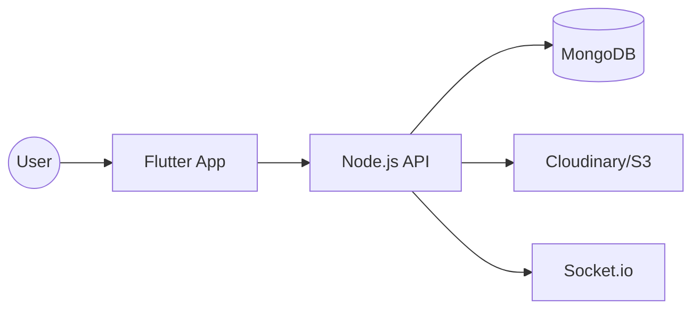

# Skill-Based Job App (Tanpa CV) — Architecture Overview

---

## 1. Concept
Aplikasi pencarian kerja yang menggantikan CV tradisional dengan **Video Profile** dan **Skill Assessment**.

## 2. Tech Stack
- **Frontend:** Flutter (Mobile)
- **Backend:** Node.js (Express / NestJS)
- **Database:** MongoDB Atlas
- **Storage:** Cloudinary / AWS S3 (Video & Assets)
- **Realtime:** Socket.io (Chat & Notifications)
- **Cache:** Redis

---

## 3. High-Level Architecture

---

## 4. Database Schema (Schema Summary)

### User
- `_id`, `name`, `email`, `password_hash`, `video_url`, `skills[]`, `test_scores{}`, `created_at`

### Job
- `_id`, `title`, `company`, `description`, `required_skills[]`, `min_score`, `created_at`

### Application
- `_id`, `user_id`, `job_id`, `status` (applied, reviewed, accepted, rejected)

### Message
- `_id`, `sender_id`, `receiver_id`, `content`, `timestamp`

---

## 5. Key API Endpoints
- `POST /api/auth/register` & `login`
- `GET /api/user/:id` & `PUT /api/user/update`
- `GET /api/job` & `POST /api/job`
- `POST /api/apply` & `GET /api/application`
- `GET /api/test/:skill` & `POST /api/test/submit`

---

## 6. Business Logic
### Matching Score (0-100)
- **50%** Skill Match
- **30%** Test Score
- **20%** User Activity

### Video Rules
- Max 60 Seconds
- MP4 (H.264)

---

## 7. Scaling Path
- **Phase 1:** Monolith on Cloud (Railway/AWS)
- **Phase 2:** separation of Chat & Auth services
- **Phase 3:** Full Microservices + Redis + CDN

---

## 8. Conclusion
Simple, fast, and skill-oriented.