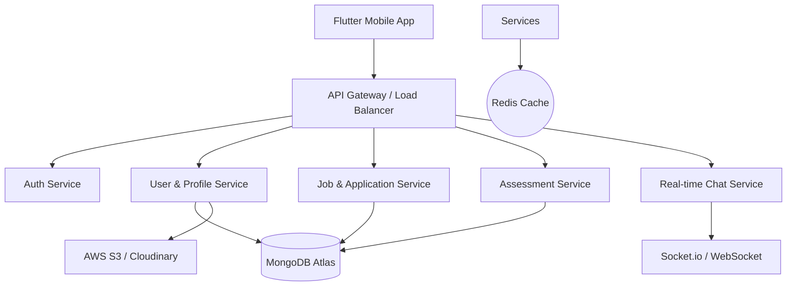

# Skill-Based Job Platform (Tanpa CV) — System Design Document

---

## 1. Introduction

### 1.1 Purpose
Dokumen ini mendeskripsikan desain sistem untuk platform pencarian kerja berbasis skill dan video, yang menggantikan CV tradisional dengan pendekatan yang lebih modern dan praktis.

### 1.2 Objectives
- Mempermudah proses rekrutmen melalui video profile.
- Mengurangi bias CV tradisional dengan standarisasi skill test.
- Mempercepat screening kandidat melalui matching algorithm.
- Menyediakan evaluasi skill yang objektif dan terukur.

### 1.3 Scope
- Arsitektur sistem (Flutter & Node.js).
- Desain database NoSQL (MongoDB).
- Spesifikasi API & Real-time communication.
- Alur bisnis (Candidate & Recruiter flows).
- Strategi skalabilitas & keamanan.

---

## 2. System Overview

### 2.1 Actors
- **Candidate (User):** Mengunggah video, mengambil test, dan melamar kerja.
- **Recruiter (HR):** Memasang lowongan, melihat video kandidat, dan chatting.
- **Admin:** Mengelola kategori skill, pertanyaan test, dan moderasi konten.

### 2.2 Key Features
- **Video Profile:** Pengganti CV berupa video maksimal 60 detik.
- **Skill Assessment:** Tes skill terstandarisasi untuk validasi kemampuan.
- **Smart Job Matching:** Algoritma untuk mencocokkan kandidat dengan lowongan.
- **Real-time Chat:** Komunikasi langsung antara HR dan Kandidat.
- **Application Tracking:** Dashboard status lamaran (Applied, Reviewed, Accepted, Rejected).

---

## 3. High-Level Architecture



---

## 4. System Components

### 4.1 Client Layer
- **Technology:** Flutter (iOS & Android).
- **Responsibilities:** UI/UX, Video Recording/Local Compression, Real-time Chat UI.

### 4.2 Backend Layer
- **Technology:** Node.js (NestJS preferred for scalability).
- **Communication:** REST API for CRUD, WebSockets for Chat & Notifications.

### 4.3 Database & Storage
- **Primary DB:** MongoDB (Flexible schema for user skills & test results).
- **Cache:** Redis for session & job match results.
- **File Storage:** Cloudinary (Video optimization) or AWS S3.

---

## 5. Database Design (Collections)

### 5.1 User Collection
```json
{
  "_id": "ObjectId",
  "name": "String",
  "email": "String",
  "password_hash": "String",
  "video_url": "String",
  "skills": ["String"],
  "test_scores": {
    "skill_id": "Number"
  },
  "created_at": "ISODate"
}
```

### 5.2 Job Collection
```json
{
  "_id": "ObjectId",
  "title": "String",
  "company": "String",
  "description": "String",
  "required_skills": ["String"],
  "min_score": "Number",
  "created_at": "ISODate"
}
```

### 5.3 Application Collection
```json
{
  "_id": "ObjectId",
  "user_id": "ObjectId",
  "job_id": "ObjectId",
  "status": "String (applied, reviewed, accepted, rejected)",
  "created_at": "ISODate"
}
```

### 5.4 Test Collection
```json
{
  "_id": "ObjectId",
  "skill": "String",
  "questions": [
    {
      "q": "String",
      "options": ["String"],
      "answer_idx": "Number"
    }
  ]
}
```

### 5.5 Message Collection
```json
{
  "_id": "ObjectId",
  "sender_id": "ObjectId",
  "receiver_id": "ObjectId",
  "content": "String",
  "timestamp": "ISODate"
}
```

---

## 6. API Specification

### Auth
- `POST /api/auth/register`
- `POST /api/auth/login`

### User & Profile
- `GET /api/user/:id`
- `PUT /api/user/update` (Update profile/skills)
- `POST /api/user/upload-video` (Presigned URL/Direct upload)

### Job
- `POST /api/job` (Create job - HR only)
- `GET /api/job` (List jobs with filter)
- `GET /api/job/:id` (Job detail)

### Application
- `POST /api/apply` (Apply to job)
- `GET /api/application` (List applications)
- `PUT /api/application/:id` (Update status - HR only)

### Assessment
- `GET /api/test/:skill` (Get questions)
- `POST /api/test/submit` (Submit answers & calculate score)

### Chat
- `GET /api/chat/rooms` (List rooms)
- `GET /api/chat/:room_id` (Message history)

---

## 7. Core Workflows

### 7.1 Candidate Flow
1. **Register:** Create account.
2. **Setup Profile:** Upload video (max 60s) & input skills.
3. **Assessment:** Ambil tes untuk validasi skill agar muncul di hasil matching.
4. **Explore:** Lihat lowongan yang direkomendasikan.
5. **Apply:** Kirim lamaran tanpa perlu upload PDF CV.

### 7.2 Recruiter Flow
1. **Post Job:** Input kriteria & skor minimum skill.
2. **Review:** Lihat daftar pelamar, urutkan berdasarkan match score.
3. **Screening:** Tonton video profile kandidat (cepat & efisien).
4. **Action:** Hubungi via chat jika cocok, atau update status lamaran.

---

## 8. Matching Algorithm

### 8.1 Scoring Formula
Match Score (0-100) dihitung berdasarkan:
- **Skill Match (50%):** Persentase kecocokan skill kandidat dengan kebutuhan lowongan.
- **Test Score (30%):** Rata-rata nilai tes pada skill yang dibutuhkan.
- **User Activity (20%):** Seberapa baru profil diperbarui atau keaktifan lamaran.

---

## 9. Video System

### Constraints
- **Max Duration:** 60 seconds.
- **Format:** MP4 (H.264/AAC).
- **Processing:** Upload → Transcoding (720p) → CDN Delivery.

---

## 10. Realtime System (Socket.io)

### Events
- `message_sent`: Mengirim pesan baru.
- `notification_received`: Update status lamaran atau pesan baru.
- `application_status_update`: Notifikasi ke kandidat saat HR mereview lamaran.

---

## 11. Security & scaling

### Security
- **JWT:** Stateless authentication.
- **Bcrypt:** Password hashing.
- **Rate Limiting:** Mencegah brute force & spam API.
- **File Validation:** Cek tipe & ukuran video sebelum disimpan.

### Scaling
- **Phase 1 (MVP):** Monolithic Node.js on Railway/App Engine.
- **Phase 2 (Growth):** Microservices separation (Auth, Chat separate).
- **Phase 3 (Scale):** Global CDN, Redis Caching, DB Sharding.

---

## 12. Conclusion
Aplikasi ini berfokus pada efisiensi rekrutmen dengan membuang hambatan "dokumen kertas" dan menggantinya dengan validasi skill nyata serta kesan personal melalui video.
ndustri modern.